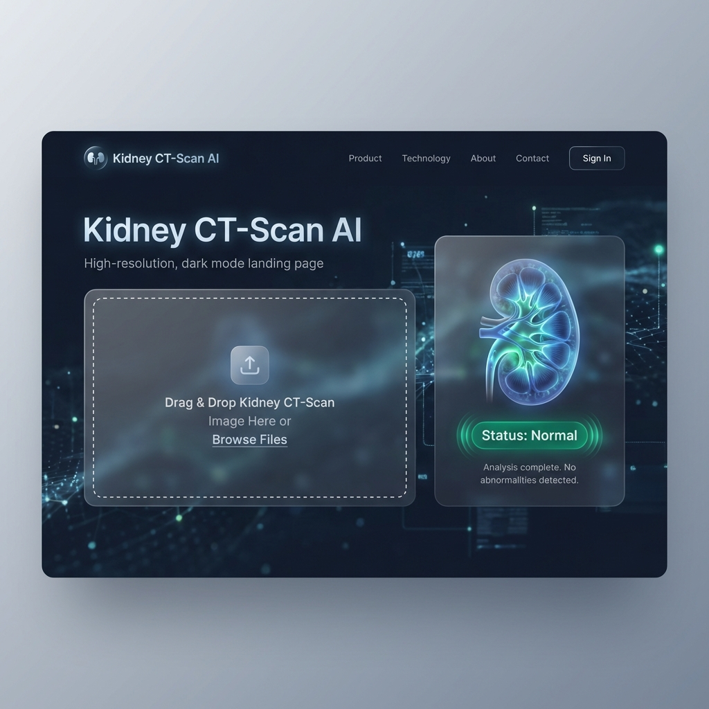
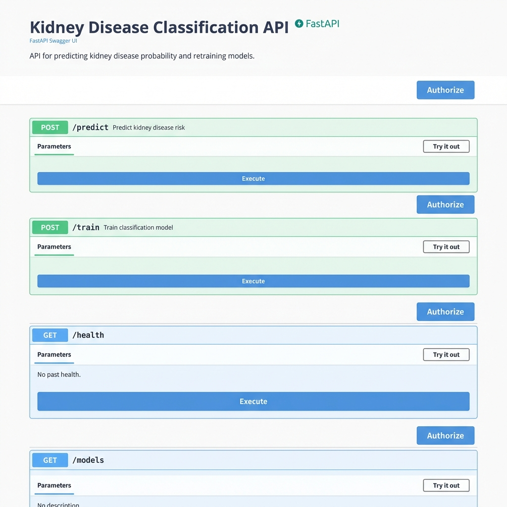

# 🏥 Kidney Disease Classification - MLflow & DVC

[](https://www.python.org/downloads/)
[](https://mlflow.org/)
[](https://dvc.org/)
[](https://www.docker.com/)
[](https://fastapi.tiangolo.com/)
[](https://opensource.org/licenses/MIT)

## 🌟 Overview
This project is a **Production-Ready Deep Learning System** designed to classify kidney CT scan images into **Normal** or **Tumor** categories. It leverages industry-standard MLOps practices, including modular code architecture, experiment tracking, data versioning, and automated CI/CD deployment.

---

## 🚀 Key Features
- **Modular Pipeline**: Decoupled stages for Data Ingestion, Base Model Preparation, Training, and Evaluation.
- **MLflow Integration**: Full experiment tracking (parameters, metrics, and model versioning).
- **DVC (Data Version Control)**: Pipeline orchestration and data versioning for reproducibility.
- **Premium User Interface**: Modern Dark-Mode Web Dashboard (FastAPI/HTML/CSS) with Glassmorphism.
- **High Performance**: Achieved **93.5% Accuracy** on Kidney CT scan classification.
- **Automated API Documentation**: Full Swagger/OpenAPI documentation for developer-friendly integration.
- **Data & Model Versioning**: DVC orchestrated pipelines with optional S3 remote storage.

---

## 📈 Model Performance
| Metric | Value |
|--------|-------|
| **Accuracy** | **93.53%** |
| **Loss** | **0.4454** |
| **Epochs** | 10 |
| **Base Model** | VGG16 (Transfer Learning) |

---

## 🎨 Visual Showcase

### Modern Dark-Mode Dashboard


### Automated API Documentation (Swagger UI)


---

## 🏗️ Project Architecture
The project follows a modular "Entity-Config-Component-Pipeline" structure:
1. **Config**: Centralized configuration in `config.yaml`.
2. **Entity**: Data classes for structured configuration.
3. **Components**: The actual logic (Data Ingestion, Model Trainer, etc.).
4. **Pipeline**: Orchestration of different stages.

---

## 💻 Tech Stack
- **Frameworks**: TensorFlow, Keras, FastAPI
- **MLOps**: MLflow, DVC, GitHub Actions, Pytest
- **DevOps**: Docker, AWS (ECR, EC2)
- **Database/Storage**: S3 (Remote), Local Artifacts

---

## 🛠️ Installation & Setup

### STEP 01 - Clone the Repository
```bash
git clone https://github.com/Ibrarhussainmughal/Kidney-Disease-Classification-MLflow-DVC
cd Kidney-Disease-Classification-MLflow-DVC
```

### STEP 02 - Create Environment
```bash
conda create -n kidney python=3.8 -y
conda activate kidney
```

### STEP 03 - Install Dependencies
```bash
pip install -r requirements.txt
```

---

## 🔄 Running the Pipeline

To run the entire MLOps pipeline using DVC:
```bash
dvc repro
```

Alternatively, run the manual entry point:
```bash
python main.py
```

---

## 🌐 Web Application
To start the modern FastAPI server locally:
```bash
python main_api.py
```
- **Dashboard**: Open **`http://localhost:8080`**
- **Interactive API Docs**: Open **`http://localhost:8080/docs`** (Swagger UI)

### 🧪 Testing with Swagger UI
1. Navigate to `/docs`.
2. Expand the `POST /predict_image` endpoint.
3. Click **"Try it out"**.
4. Upload a kidney CT scan image (`.jpg` or `.png`).
5. Click **"Execute"** to see the model's prediction result.

---

## 🐳 Deployment (AWS)
This project is configured for automated deployment to AWS:
1. **Continuous Integration**: Code linting and unit tests.
2. **Continuous Delivery**: Docker image built and pushed to **Amazon ECR**.
3. **Continuous Deployment**: Latest image pulled and run on **Amazon EC2**.

---

## 👨‍💻 Author
**Ibrar Hussain Mughal**
- **GitHub**: [@Ibrarhussainmughal](https://github.com/Ibrarhussainmughal)
- **Email**: ibrarali69.ia@gmail.com

---
*This project was developed as a case study for professional MLOps implementation.*

# Final Production Deployment: 02/05/2026 11:34:03
